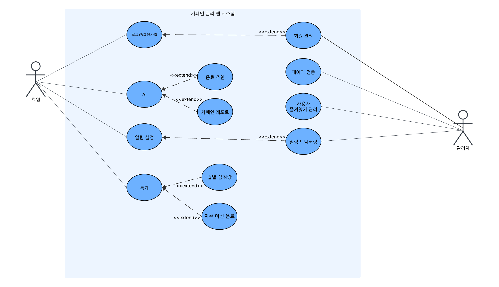
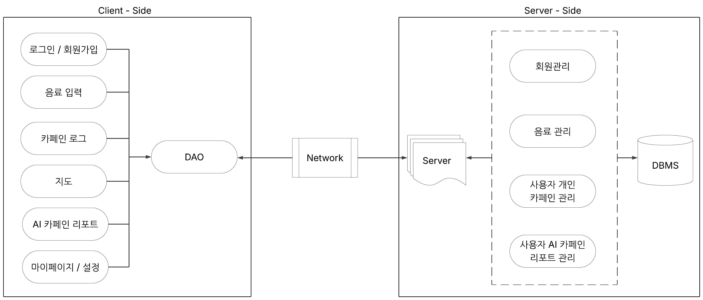
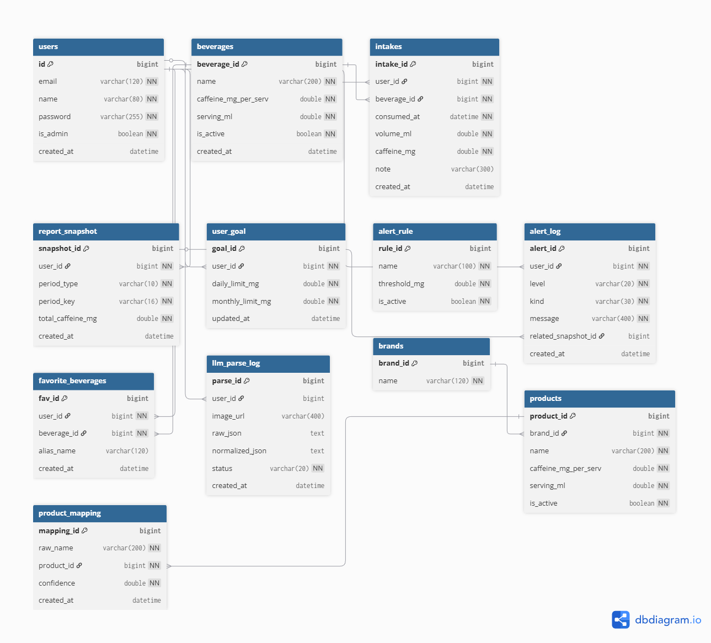

## 2025-2-OSSProj-semicolon-02
### 개인 맞춤 카페인 코치: Caffit(카핏)

### 0. 팀 구성

| 구분 | 성명   | 역할                 | 소속학과        | 이메일 |
|------|--------|----------------------|-----------------|--------|
| 팀장 | 강서현 | 프론트엔드, 서버, OSS    | 산업시스템공학과 | seohyunso0916@gmail.com |
| 팀원 | 김민솔 | 프론트엔드, 서버, OSS    | 정보통신공학과   | gwsak@dgu.ac.kr |
| 팀원 | 이은정 | 프론트엔드, AI   | 산업시스템공학과 | etlee12@naver.com |

### 1. 개발 목표
- OCR 기반 카페인 섭취 자동 기록  
- 개인 반감기 추정 및 맞춤형 카페인 리포트 생성  
- 과다 섭취 경고 및 무카페인 대체 음료 추천  
- 사용자 건강·생활 패턴 개선을 위한 모바일 앱 제공

### 2. 설계 및 구현

**2-1) 전체 아키텍처**
- Front-end : React Native (JavaScript/TypeScript)
- Back-end : Spring Boot (Java, REST API, JPA)
- AI Module : Flask (Python, TensorFlow/Keras/PyTorch, Hugging Face)
- DB : MySQL (AWS RDS)
- 배포 : AWS EC2 + Elastic Beanstalk, Docker

- 유스케이스 다이어그램  

- 시스템 블록 다이어그램  

- ERD  

**2-2) 주요 기능 흐름**
- 음료 등록 (OCR/수동/즐겨찾기)  
- 개인 카페인 리포트 (일/주/월)  
- 목표 설정 및 알림  

### 3. 서비스 구현 결과

### 4. 기대효과

### 5. 실행 방법

### 6. 자료 관리
**제안발표**

[수행계획서](./Docs/1_1_OSSProj_02_세미콜론_수행계획서.pdf)  
[발표자료](./Docs/1_2_OSSProj_02_세미콜론_수행계획발표자료.pdf)  
[회의록](./Docs/1_3_OSSProj_02_세미콜론_회의록.pdf)

### 7. 이슈 관리