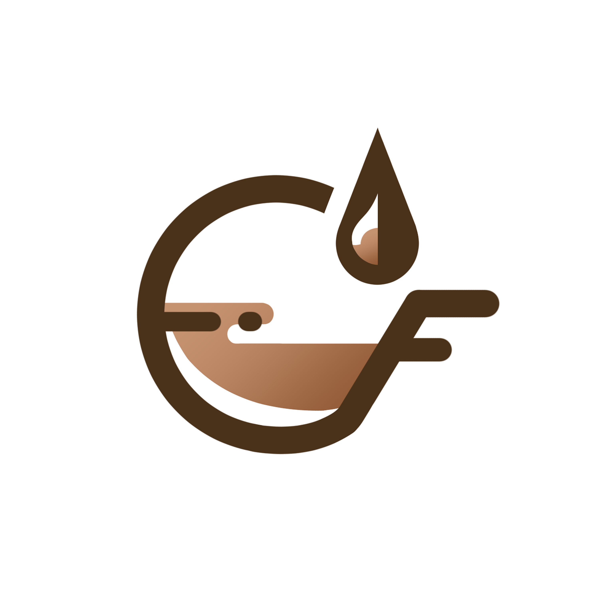
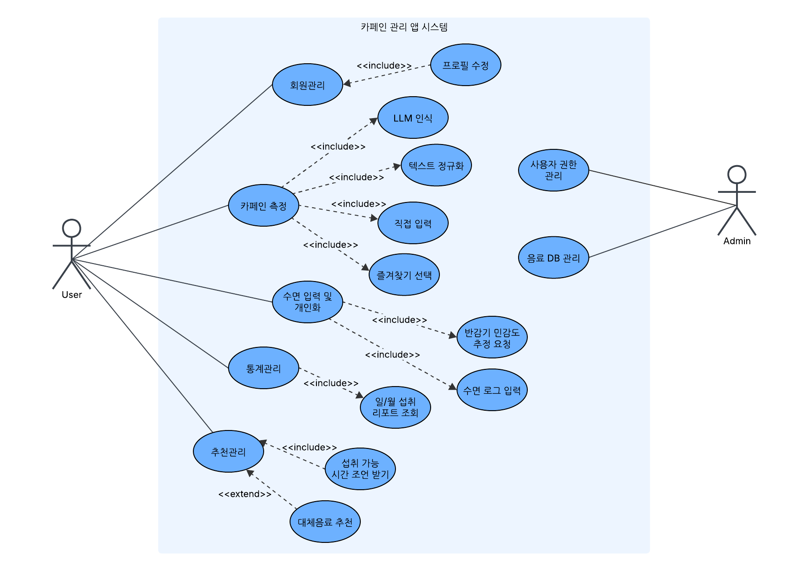
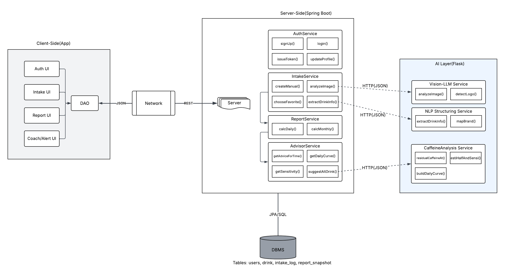
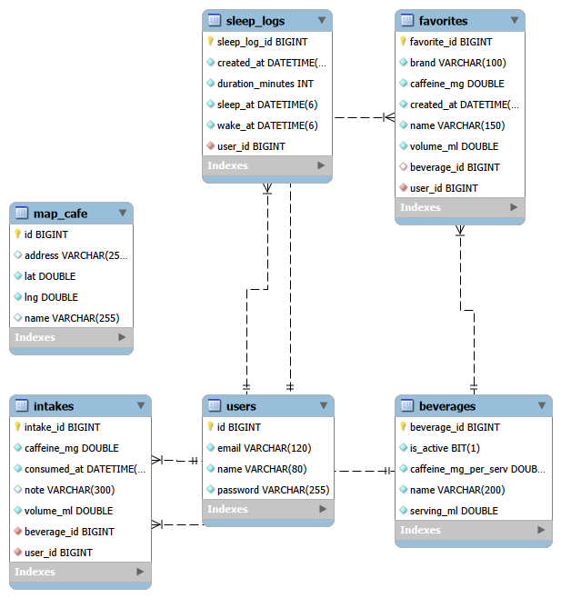
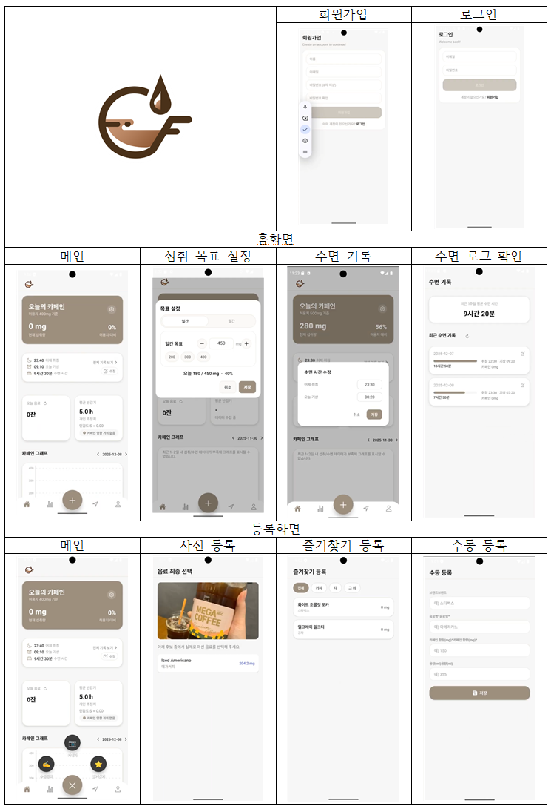
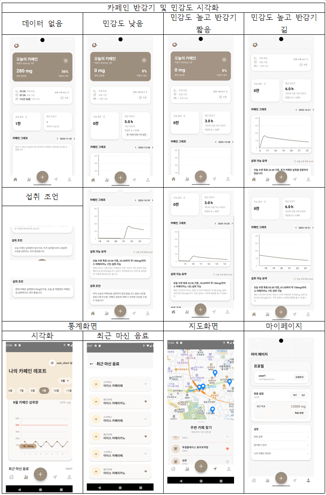

# Caffit(카핏): 개인 맞춤 카페인 코치  
## 2025-2-OSSProj-semicolon-02
&nbsp;
&nbsp;
---
&nbsp;
&nbsp;
### 0. 팀 구성

| 구분 | 성명 | 역할 | 소속 |
|------|-------|--------|---------|
| 팀장 | 강서현 | 프론트엔드 · 백엔드 | 산업시스템공학과 |
| 팀원 | 김민솔 | 프론트엔드 · 백엔드 | 정보통신공학과 |
| 팀원 | 이은정 | 프론트엔드 · AI | 산업시스템공학과 |
&nbsp;
&nbsp;
---
&nbsp;
&nbsp;
### 1. 개발 목표

- LLM 기반 음료 라벨 자동 인식  
- 수면 데이터 기반 개인 반감기 추정
- AI Agent 기반 카페인 리포트 자동 생성  
- 권장량 초과 시 실시간 알림  
- 국내 음료 DB 기반 정확한 카페인 추적  
&nbsp;
&nbsp;
---
&nbsp;
&nbsp;
### 2. 시스템 구조
&nbsp;
#### 2-1. 전체 아키텍처
- Frontend: React Native (TypeScript)
- Backend: Spring Boot (REST API)
- AI Module: Flask (Python, LLM + RAG + AI Agent)
- DB: MySQL (AWS RDS)
- 배포: AWS EC2 / Elastic Beanstalk / Docker
&nbsp;
##### 유스케이스 다이어그램

&nbsp;
##### 시스템 블록 다이어그램

&nbsp;
##### ERD

&nbsp;
---
&nbsp;
#### 2-2. 주요 기능
&nbsp;
##### 1) 회원 관리  
- 로그인/회원가입 (Google OAuth 예정)  
- 마이페이지: 목표 설정, 알림 설정, 즐겨찾기 관리  
&nbsp;
##### 2) 카페인 측정 관리  
- 직접 등록  
- 즐겨찾기 등록  
- 사진 기반 음료 자동 인식 (LLM) 
&nbsp;
##### 3) 통계 관리  
- 수면 기록 관리
- 섭취 기록 관리리
- 월간 섭취 통계계
- 시간대별 농도 변화  
&nbsp;
##### 4) 추천/리포트 관리  
- 수면과 섭취 시각을 결합한 개인 민감도, 반감기 추정 
- 실시간 잔여량 계산  
- 권장량 초과 경고  
- AI Agent 기반 자연어 리포트 자동 생성 
  - 과다 섭취 패턴  
  - 시간대별 위험 구간  
  - 개인 민감도 변화  
&nbsp;
##### 5) 지도  
- 현재 위치 기반 카페 탐색  
- 마커 기반 주변 카페 조회  
&nbsp;
&nbsp;
---
&nbsp;
&nbsp;
### 3. 앱 화면 



&nbsp;
&nbsp;

### 4. 실행 방법
&nbsp;
#### Frontend
```sh
cd frontend
npm install
npx react-native run-android
```

#### Backend (Spring Boot)
```sh
cd backend
./gradlew bootRun
```
&nbsp;
&nbsp;
---
&nbsp;
&nbsp;
### 6. 기대효과
| 측면 | 내용 |
|------|------|
| 건강적 | 불면·불안 등 부작용 예방, 수면 질 향상 |
| 기술적 | LLM·RAG 기반 이미지 인식, AI Agent 자율 분석 |
| 사회적 | 청소년·취약계층 보호, 건강 문화 확산 |
| 경제적 | 데이터 기반 음료 추천·마케팅 연계 가능 |
&nbsp;
&nbsp;
---
&nbsp;
&nbsp;
### 7. 자료 관리
&nbsp;
**제안 발표**

[수행계획서](./Docs/1_1_OSSProj_02_세미콜론_수행계획서.pdf)  
[수행계획발표자료](./Docs/1_2_OSSProj_02_세미콜론_수행계획발표자료.pdf)  
[회의록](./Docs/1_3_OSSProj_02_세미콜론_회의록.pdf)
&nbsp;
**중간 발표**

[중간보고서](./Docs/2_1_OSSProj_02_세미콜론_중간보고서.pdf)  
[중간발표자료](./Docs/2_2_OSSProj_02_세미콜론_중간발표자료.pdf)  
[회의록](./Docs/2_3_OSSProj_02_세미콜론_회의록.pdf)
&nbsp;
**최종 발표**

[최종보고서](./Docs/3_1_OSSProj_02_세미콜론_최종보고서.pdf)  
[최종발표자료]()  
[회의록](./Docs/3_3_OSSProj_02_세미콜론_회의록.pdf)
[제품구성배포운영자료](./Docs/3_4_OSSProj_02_세미콜론_제품구성배포운영자료.pdf)
[시연동영상](./Docs/3_5_OSSProj_02_세미콜론_시연동영상.pdf)
&nbsp;
&nbsp;
&nbsp;
---
&nbsp;
&nbsp;
### 8. 참고문헌
- 김예분 외, *대학생의 카페인 음료 섭취와 수면의 질*, 대한보건학회지, 2014  
- Seo & Lee, *Perception and intake of caffeinated beverages*, J. East Asian Society of Dietary Life, 2020  
- Choi et al., *Effects of caffeine dosage and timing on vascular/cognitive functions*, Applied Sciences, 2025  
- CaffeineCatch / Daily Coffee / CaffeInMe / PURIFY 앱 참조  
