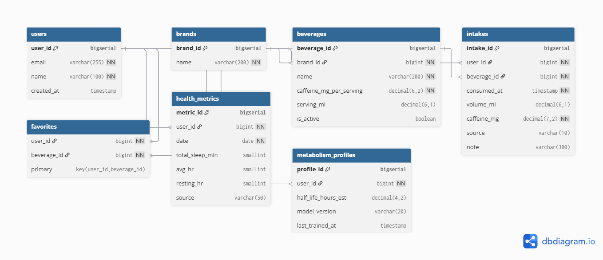

## 2025-2-OSSProj-semicolon-02
### 개인 맞춤 카페인 코치: Caffit(카핏)

### 0. 팀 구성

| 구분 | 성명   | 역할                 | 소속학과        | 이메일 |
|------|--------|----------------------|-----------------|--------|
| 팀장 | 강서현 | 프론트엔드, 서버, OSS    | 산업시스템공학과 | seohyunso0916@gmail.com |
| 팀원 | 김민솔 | 프론트엔드, 서버, OSS    | 정보통신공학과   | gwsak@dgu.ac.kr |
| 팀원 | 이은정 | 프론트엔드, AI   | 산업시스템공학과 | etlee12@naver.com |

### 1. 개발 목표

- LLM 기반 음료 인식 자동화  
- 개인 반감기 추정 AI를 통한 맞춤형 카페인 리포트  
- 권장량 초과 시 실시간 알림  
- 무카페인 대체 음료 추천 및 생활 리듬 개선 
 
### 2. 설계 및 구현

**2-1) 전체 아키텍처**
- Front-end: React Native (TypeScript)
- Back-end: Spring Boot (Java, REST API)
- AI Module: Flask (Python, LLM + RAG)
- DB: MySQL (AWS RDS)
- 배포: AWS EC2 + Elastic Beanstalk + Docker

- 유스케이스 다이어그램  

- 시스템 블록 다이어그램  

- ERD  

**2-2) 주요 기능 흐름**
#### 회원 관리
- 로그인 / 회원가입 (Google OAuth 예정)
- 마이페이지 (목표 설정, 알림·즐겨찾기 관리)

#### 카페인 측정 관리
- 직접 등록: 브랜드, 함량, 용량 직접 입력  
- 즐겨찾기 등록: 반복 섭취 음료 원클릭 등록  
- 사진 등록: LLM 자동 인식으로 제품 정보 추출  

#### 통계 관리
- 월별 섭취 요약, 최다 섭취 음료, 시간대별 패턴  
- 시각화된 레포트 제공 및 사용자 인사이트 분석  

#### 추천 관리
- 개인 반감기 예측 기반 대시보드  
- 권장량 초과 시 실시간 경고 및 무카페인 대체 음료 추천  

#### 지도
- 현재 위치 기반 주변 카페 탐색  
- 실시간 카페 마커 표시 및 정보 조회  

### 3. 서비스 구현 결과

### 4. 기대효과
| 측면 | 내용 |
|------|------|
| 건강적 | 불면·불안 등 부작용 예방, 수면 질 향상 |
| 기술적 | LLM·RAG 기반 이미지 인식, AI Agent 자율 분석 |
| 사회적 | 청소년·취약계층 보호, 건강 문화 확산 |
| 경제적 | 데이터 기반 음료 추천·마케팅 연계 가능 |

### 5. 실행 방법

### 6. 자료 관리
**제안 발표**

[수행계획서](./Docs/1_1_OSSProj_02_세미콜론_수행계획서.pdf)  
[수행계획발표자료](./Docs/1_2_OSSProj_02_세미콜론_수행계획발표자료.pdf)  
[회의록](./Docs/1_3_OSSProj_02_세미콜론_회의록.pdf)

**중간 발표**

[중간보고서](./Docs/2_1_OSSProj_02_세미콜론_중간보고서.pdf)  
[중간발표자료](./Docs/2_2_OSSProj_02_세미콜론_중간발표자료.pdf)  
[회의록](./Docs/2_3_OSSProj_02_세미콜론_회의록.pdf)

### 7. 이슈 관리

### 8. 참고문헌
- 김예분 외, *대학생의 카페인 음료 섭취와 수면의 질*, 대한보건학회지, 2014  
- Seo & Lee, *Perception and intake of caffeinated beverages*, J. East Asian Society of Dietary Life, 2020  
- Choi et al., *Effects of caffeine dosage and timing on vascular/cognitive functions*, Applied Sciences, 2025  
- CaffeineCatch / Daily Coffee / CaffeInMe / PURIFY 앱 참조  